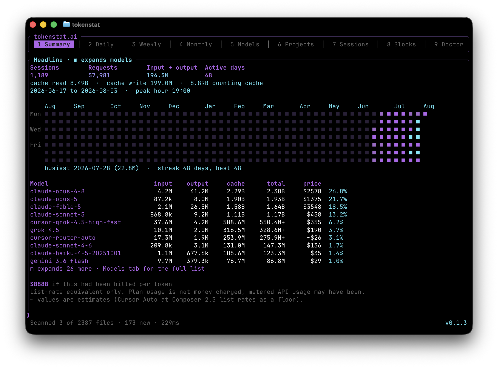

<div align="center">

# tokenstat

Monitor AI work, everywhere

[](https://github.com/gyorgysh/tokenstat/actions/workflows/ci.yml)
[](LICENSE)
[](https://github.com/gyorgysh/tokenstat/releases)
[](https://tokenstat.ai)

[Install](#install) · [CLI](#command-line) · [Privacy](#privacy) · [Contributing](CONTRIBUTING.md)

</div>

tokenstat is a local-first app for the AI coding tools you already use. It reads
their local records, shows tokens, models, projects, sessions, and estimated
API value in one place, then lets you work with those machines from the desktop
app or an optional synced account.

The Mac and Windows apps, the iPhone and Android clients, the CLI, and the MCP
server all share one core. The website at [tokenstat.ai](https://tokenstat.ai)
is a separate project. This repository is everything that runs on your machine.

<p align="center">
  
</p>

<p align="center">
  A synced profile, if you want one: <a href="https://tokenstat.ai/gyorgy"><strong>tokenstat.ai/gyorgy</strong></a>
</p>

## Highlights

- **Local first.** Counters stay on your machine. Conversation text never reaches the archive
- **Desktop apps.** Home, Insights, Devices, workspaces, tasks, notes, workflows, and automations, over one host daemon
- **Mac and Windows.** The Mac app is a signed disk image. The Windows app is a zip: double-click `Tokenstat.exe` to install for this user
- **Phone clients.** iPhone and Android read the same archive, with a terminal onto a machine you already run
- **Many sources.** Claude Code, Codex, Grok, OpenCode, Cline, Antigravity, OpenClaw, Zed, Copilot CLI, Pi, Hermes Agent, Kilo Code, DeepSeek Harness, plus Cursor fetch
- **One schema.** Daily, weekly, monthly, and per-model views across every tool
- **MCP.** Agents can ask their own spend over stdio, no hosted server
- **Optional sync.** Sealed aggregates to `tokenstat.ai/<handle>` when you link an account ([live example](https://tokenstat.ai/gyorgy))

## Supported sources

| Kind | Tools |
| --- | --- |
| On disk | Claude Code (with rollup recovery), Codex, Grok, OpenCode, Cline, Antigravity CLI, OpenClaw, Zed, Copilot CLI, Pi, Hermes Agent, Kilo Code, DeepSeek Harness |
| Remote fetch | Cursor (keychain or pasted token, 30 minute cache) |
| IDE sync | Antigravity IDE (app open, then `tokenstat fetch`) |

Plan quota for Antigravity is reported separately and is never turned into fake token events.

## Architecture

<p align="center">
  
</p>

```
crates/
  tokenstat-core/   Parsing, normalization, pricing, aggregation. No network.
  tokenstat-cli/    Command line front end.
  tokenstat-sync/   The only crate that talks to the network.
  tokenstat-mcp/    MCP server over the core facade.
  tokenstat-host/   Protocol, session, dispatch, unix socket or Windows named pipe.
  tokenstat-ffi/    C ABI over the host. JSON in, JSON out.
apps/
  mac/              SwiftUI app (macOS, iOS, iPadOS).
  windows/          WinUI 3 app. Unpackaged, per-user install, named-pipe hostd.
  android/          Kotlin/Compose client over the FFI.
```

Keeping logic in `tokenstat-core` means every front end shares one implementation.
The split is also what makes the privacy claim structural: the crate that reads
your logs has no way to send them anywhere, because it does not link a network
stack at all. Front ends call one function, `tokenstat-host::dispatch`.

## Install

Release builds are on [GitHub Releases](https://github.com/gyorgysh/tokenstat/releases)
and at [tokenstat.ai](https://tokenstat.ai).

### macOS app

Download the disk image, open it, and drag tokenstat into Applications. After
that it keeps itself current. It fetches each release, checks the download
against the release checksums and against the signature macOS itself would
check, installs it, and then offers a relaunch. It never restarts on its own.

### Windows app

Download `tokenstat-<version>-windows-x64.zip`, unzip, and double-click
`Tokenstat.exe`. It copies itself to `%LOCALAPPDATA%\Programs\tokenstat`, writes
a Start Menu shortcut, and registers Add/Remove Programs. After that it updates
itself the same way: checksums, and a publisher check once the running build is
signed. Do not put the CLI in the same folder as the app. Windows paths are
case-insensitive.

### Command line

Website one-liners download the matching GitHub Release binary into a
user-writable path (`~/.local/bin` on macOS/Linux, `%LOCALAPPDATA%\tokenstat`
on Windows), verify `SHA256SUMS`, and run `tokenstat setup` (scan, hourly
schedule, and an account prompt on a TTY). Self-update (`tokenstat update`)
needs that user-writable path. System prefixes like `/usr/local/bin` are
refused.

```bash
# macOS / Linux
curl -fsSL https://tokenstat.ai/install.sh | bash
```

```powershell
# Windows (PowerShell)
irm https://tokenstat.ai/install.ps1 | iex
```

The scripts in this repo ([`scripts/install.sh`](scripts/install.sh),
[`scripts/install.ps1`](scripts/install.ps1)) are the source of truth. Opt out
of the schedule with `--no-schedule` (Unix) or `TOKENSTAT_NO_SCHEDULE=1`.

```bash
tokenstat setup             # scan, schedule, and offer to connect an account
tokenstat update --check
tokenstat update
```

`setup` is safe to re-run. One confirmation at the start on a TTY, then it gets
on with it. Piped or scripted runs (including the install scripts) proceed with
defaults without `--yes`. `--local-only` skips the account step,
`--no-schedule` skips the hourly scan install, and `--code WXYZ-1234` connects
using a code from [tokenstat.ai/link](https://tokenstat.ai/link). A linked
account publishes a page like [tokenstat.ai/gyorgy](https://tokenstat.ai/gyorgy).

`update` verifies `SHA256SUMS`, runs the downloaded binary to confirm
`--version` and `--help`, then swaps it in. The old binary is moved aside and
restored if the new one cannot run from its final path.

Automatic daily updates are on by default after `setup` / schedule install.
They still verify checksum and run the new binary before replacing this one.
Opt out:

```bash
tokenstat update --auto off
```

macOS builds are Developer ID signed and notarized when repository secrets are
configured (see [CONTRIBUTING.md](CONTRIBUTING.md)). After a website install,
`~/.local/bin/tokenstat` is that release: do not overwrite it with a local
`cargo` build, and do not ad-hoc `codesign --sign -` it (that strips the
Developer ID signature). Scheduler entries prefer the signed install when both
a release and a cargo binary are present. When the installed binary carries a
real signing identity, a replacement must too.

From source:

```bash
cargo install --path crates/tokenstat-cli
```

## Uninstalling

```bash
# macOS / Linux
curl -fsSL https://tokenstat.ai/uninstall.sh | bash
curl -fsSL https://tokenstat.ai/uninstall.sh | bash -s -- --purge --yes   # also delete archive
```

```powershell
# Windows
irm https://tokenstat.ai/uninstall.ps1 | iex
$env:TOKENSTAT_PURGE="1"; $env:TOKENSTAT_YES="1"; irm https://tokenstat.ai/uninstall.ps1 | iex
```

See [`scripts/uninstall.sh`](scripts/uninstall.sh) and
[`scripts/uninstall.ps1`](scripts/uninstall.ps1). They remove the schedule
first, then the binary. The archive is left alone unless you pass
`--purge` / `TOKENSTAT_PURGE=1`. The Windows app also appears in
Settings → Apps, which runs `Tokenstat.exe --uninstall`.

| Platform | Data directory |
| --- | --- |
| macOS | `~/Library/Application Support/ai.tokenstat.tokenstat` |
| Linux | `~/.local/share/tokenstat` |
| Windows | `%APPDATA%\tokenstat\tokenstat\data` |

Removing the local install does not delete a hosted profile. Export or delete the
account from the website settings if you made one.

## Command line

```bash
tokenstat scan
tokenstat
```

`scan` reads your logs into a local archive. Everything else reads that archive.
Bare `tokenstat` on a TTY opens a full-screen client with tabs, headline stats,
and a command field. If the archive was last scanned more than 10 minutes ago,
it rescans automatically on open. Piped use and `tokenstat summary` print the
one-shot report.

| Command | Shows |
| --- | --- |
| `tokenstat` | Full-screen interactive client (TTY) |
| `tokenstat summary` | Headline numbers, activity grid, model breakdown |
| `tokenstat heatmap` | Activity heatmap (JSON contract for the website profile) |
| `tokenstat wrapped` | Year-in-review from the local archive |
| `tokenstat daily` / `weekly` / `monthly` | Usage per day, ISO week, or month |
| `tokenstat models` / `projects` / `sessions` | Breakdowns |
| `tokenstat models --detail` | Per model, with context window, capabilities, and benchmark scores |
| `tokenstat blocks` | Five-hour usage windows |
| `tokenstat budget` | Soft list-rate caps (`--daily` / `--monthly`) |
| `tokenstat export` | CSV or JSON dump of events |
| `tokenstat auth` / `fetch` | Vendor tokens and remote usage |
| `tokenstat pricing` | Local list-rate snapshot (`--refresh` to fetch) |
| `tokenstat catalog` | Local model catalog and plans snapshot (`--refresh` to fetch) |
| `tokenstat plans` | Subscription plan prices next to your own list-rate equivalent |
| `tokenstat mcp` | MCP server over stdio |
| `tokenstat doctor` | Archive health and reconciliation |
| `tokenstat statusline` | One line for a shell prompt |
| `tokenstat setup` | Scan, schedule, and optionally connect an account |
| `tokenstat schedule` | Automatic scanning, syncing, and updates |
| `tokenstat update` | Check or apply a newer release build |
| `tokenstat login` / `sync` | Link this machine and upload sealed aggregates |

Filters: `--since`, `--until`, `--last N`, `--model`, `--project`. Every command
accepts `--json`.

### The archive backs itself up

The archive is not reconstructible. The tools that wrote your transcripts
delete them after about 30 days and vendor rollup windows slide, so a rescan
run months in reads a strictly smaller world than the archive already holds.

So a scan takes one copy a day and keeps seven, logrotate style:
`tokenstat.db.0` is newest, `tokenstat.db.6` oldest, and the oldest is dropped
on each rotation. Copies use SQLite's `VACUUM INTO`, which is consistent under
WAL and compacts as it writes, so a copy taken mid-scan is never torn. They are
never read back automatically. To restore, stop everything touching the archive
and copy a slot over `tokenstat.db` yourself.

`tokenstat doctor` reports how many copies exist and what they cost on disk.

List rates are not shipped in the binary. `tokenstat setup` fetches them, or run
`tokenstat pricing --refresh` and `tokenstat catalog --refresh` yourself. Both
land in your local data directory and are read offline from then on.

The two snapshots answer different questions and are kept apart on purpose. The
price book is published list rates, and a figure taken from it is printed plain.
The catalog carries provider offers, which is what lets a model the price book
has never heard of still show a number: those are marked `~` and are never
presented as a list rate.

Terminals that cannot do 24-bit colour fall back to the 256-colour palette, and
a non-UTF-8 locale swaps the box drawing and block characters for ASCII. Force
the plain rendering with `TOKENSTAT_ASCII=1`.

### Keeping your history

Claude Code deletes transcripts after 30 days by default. Install the hourly scan
before you need the numbers, not after.

```bash
tokenstat schedule --install
```

writes the scheduler entry for your platform. The website installer runs
`tokenstat setup`, which installs the scan schedule by default.

With an account linked, a sync entry uploads on your plan interval (60 / 30 / 10
minutes). A daily update check (on by default) runs with jitter and verifies
the new binary before replacing the running one. On macOS, scheduled network
work on a battery Mac checks the full-wake state first when Always-on host is
off, and exits without connecting during sleep or DarkWake. Non-battery Macs
and an explicitly enabled Always-on host keep their existing behavior.

## Development

Requires a recent stable Rust toolchain (`rust-toolchain.toml`).

```bash
cargo fmt --all
cargo clippy --all-targets --all-features -- -D warnings
cargo test --all-features
cargo build --release
```

The Mac app is generated from `apps/mac/project.yml`. The Windows app is
`apps/windows/`. The Android app is `apps/android/`. Each tree has its own
README for the extra tooling that build needs.

## Privacy

Everything happens on your machine. tokenstat reads your local session logs,
extracts token counters, and discards the rest. Only aggregate numbers are ever
eligible for sync, and the source is published so you can confirm it.

- Session logs contain prompts and code. Counting tokens means opening those
  files. The guarantee is the **boundary**: conversation text is dropped at the
  parser and never reaches the local database.
- Local reports show real project names and models. Only the sync payload uses
  salted hashes, and the salt never leaves.
- The sync payload holds dates, counts, model ids, and opaque keys. No paths,
  prompts, or hostnames. `tokenstat sync --dry-run` prints the exact bytes.
- Remote reach is separate from sync and off unless you turn it on per machine.
  The tunnel forwards an already-encrypted machine-to-machine stream and cannot
  read it. What it can see, and what the account directory then shows your own
  account, is connection metadata: which machines are reachable, when they
  talked, and how much. The machine's connection key and the name you gave it
  are registered with your account only while remote reach is on. The sync
  envelope never carries either.

The core library cannot link a network stack, enforced in CI.

## Contributing

See [CONTRIBUTING.md](CONTRIBUTING.md) for the branching model, commit message
format, and release steps.

## License

**Source-available, not open source.** One licence covers the whole
repository: see [LICENSE](LICENSE).

Every line is published so it can be read. tokenstat's claim is about what
happens to your data, and a claim nobody can check is marketing. So: read it,
study it, fork it on GitHub, build it, run your build on your own machines,
and say publicly what you find. Trust, and verify.

What is reserved is publication. You may not redistribute the source or a
build of it, put it in another product, or offer it as a service. pueev OÜ
ships the only builds of tokenstat. The name is not part of the grant either:
**"tokenstat" and the tokenstat logo are trademarks of pueev OÜ**. See
[TRADEMARK.md](TRADEMARK.md).

Releases up to v0.1.3 went out under GPL-3.0. That grant stands for those
versions and cannot be withdrawn. The licence above governs everything from
here.

### Contributions

This repository does not accept pull requests, so that pueev OÜ remains the
sole copyright holder and can keep shipping the apps. **Issues are very
welcome** and are the more useful thing anyway: a harness that is not read yet,
counts that disagree with the tool itself, or anything in the privacy claim
that does not match the code. See [CONTRIBUTING.md](CONTRIBUTING.md).
