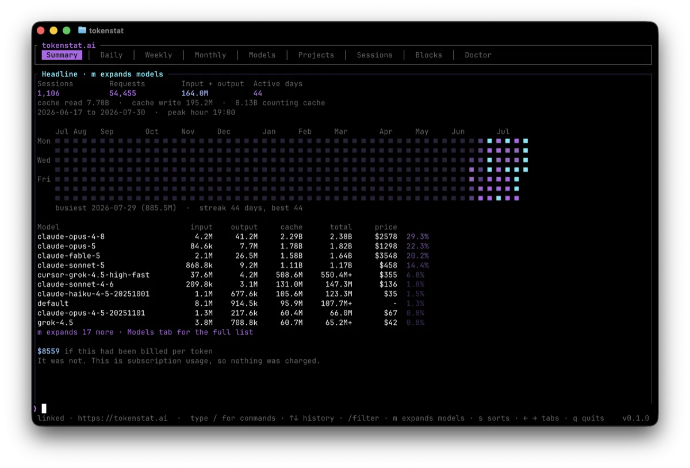
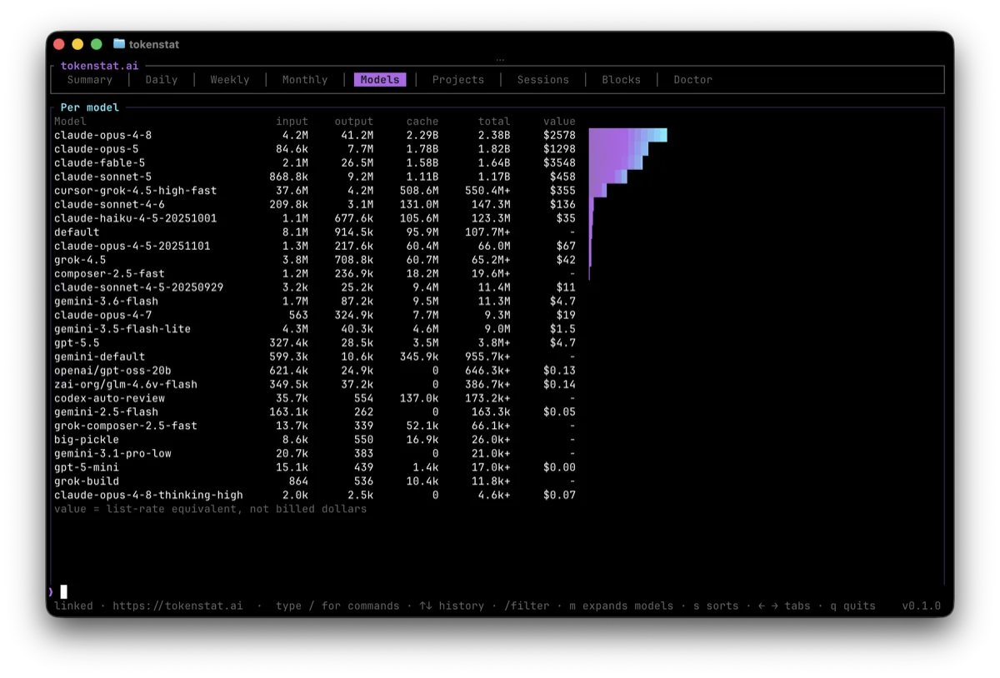

<div align="center">

# tokenstat

Unified token usage for AI coding agents and LLM tools.

[](https://github.com/gyorgysh/tokenstat/actions/workflows/ci.yml)
[](LICENSE)
[](https://github.com/gyorgysh/tokenstat/releases)
[](https://tokenstat.ai)

[Install](#install) · [Usage](#usage) · [Privacy](#privacy) · [Contributing](CONTRIBUTING.md)

</div>

`tokenstat` is the CLI for [tokenstat.ai](https://tokenstat.ai). It reads the
local session logs your tools already write, normalizes counters into one schema,
and reports spend by model, project, tool, and time. Everything runs on your
machine by default. Sync to a public profile is opt in.

<p align="center">
  
</p>

<p align="center">
  
</p>

## Highlights

- **Local first** — counters stay on your machine; conversation text never reaches the archive
- **Many sources** — Claude Code, Codex, Grok, OpenCode, Cline, Antigravity, OpenClaw, Zed, Copilot CLI, plus Cursor fetch
- **One schema** — daily, weekly, monthly, and per-model views across every tool
- **Activity heatmap** — rolling calendar with streaks, busiest day, and a purple-to-cyan ramp
- **Optional sync** — sealed aggregates to `tokenstat.ai/<handle>` when you link an account
- **Self-update** — verified GitHub Releases with rollback if the new binary cannot run

## Supported sources

| Kind | Tools |
| --- | --- |
| On disk | Claude Code (with rollup recovery), Codex, Grok, OpenCode, Cline, Antigravity CLI, OpenClaw, Zed, Copilot CLI |
| Remote fetch | Cursor (keychain or pasted token, 30 minute cache) |
| IDE sync | Antigravity IDE (app open, then `tokenstat fetch`) |

Plan quota for Antigravity is reported separately and is never turned into fake token events.

## Architecture

The website is a separate project. This repository is the CLI, shared core, and
MCP server.

```
crates/
  tokenstat-core/   Parsing, normalization, pricing, aggregation. No network.
  tokenstat-cli/    Command line front end.
  tokenstat-sync/   The only crate that talks to the network.
  tokenstat-mcp/    MCP server over the core facade.
```

Keeping logic in `tokenstat-core` means every front end shares one implementation.
The split is also what makes the privacy claim structural: the crate that reads
your logs has no way to send them anywhere, because it does not link a network
stack at all.

## Install

Website one-liners (recommended). They download the matching GitHub Release
binary into a user-writable path (`~/.local/bin` on macOS/Linux,
`%LOCALAPPDATA%\tokenstat` on Windows), verify `SHA256SUMS`, and run
`tokenstat setup` (scan, hourly schedule, and an account prompt on a TTY).
Self-update (`tokenstat update`) needs that user-writable path; system prefixes
like `/usr/local/bin` are refused.

```bash
# macOS / Linux
curl -fsSL https://tokenstat.ai/install.sh | bash
```

```powershell
# Windows (PowerShell)
irm https://tokenstat.ai/install.ps1 | iex
```

The scripts in this repo ([`scripts/install.sh`](scripts/install.sh),
[`scripts/install.ps1`](scripts/install.ps1)) are the source of truth. The
website should proxy or copy them so the one-liners stay in sync. Opt out of the
schedule with `--no-schedule` (Unix) or `TOKENSTAT_NO_SCHEDULE=1`.

Release builds are published on [GitHub Releases](https://github.com/gyorgysh/tokenstat/releases)
for macOS (Apple silicon and Intel), Windows, and Linux.

```bash
tokenstat setup             # scan, schedule, and offer to connect an account
tokenstat update --check
tokenstat update
```

`setup` is safe to re-run. One confirmation at the start on a TTY, then it gets
on with it. Piped or scripted runs (including the install scripts) proceed with
defaults without `--yes`. `--local-only` skips the account step,
`--no-schedule` skips the hourly scan install, and `--code WXYZ-1234` connects
using a code from [tokenstat.ai/link](https://tokenstat.ai/link).

`update` verifies `SHA256SUMS`, runs the downloaded binary to confirm
`--version` and `--help`, then swaps it in. The old binary is moved aside and
restored if the new one cannot run from its final path.

Automatic daily updates are on by default after `setup` / schedule install.
They still verify checksum and run the new binary before replacing this one.
Opt out:

```bash
tokenstat update --auto off
```

macOS builds are Developer ID signed and notarized when repository secrets are
configured (see [CONTRIBUTING.md](CONTRIBUTING.md)). After a website install,
`~/.local/bin/tokenstat` is that release: do not overwrite it with a local
`cargo` build, and do not ad-hoc `codesign --sign -` it (that strips the
Developer ID signature). Scheduler entries prefer the signed install when both
a release and a cargo binary are present. When the installed binary carries a
real signing identity, a replacement must too.

From source:

```bash
cargo install --path crates/tokenstat-cli
```

## Uninstalling

```bash
# macOS / Linux
curl -fsSL https://tokenstat.ai/uninstall.sh | bash
curl -fsSL https://tokenstat.ai/uninstall.sh | bash -s -- --purge --yes   # also delete archive
```

```powershell
# Windows
irm https://tokenstat.ai/uninstall.ps1 | iex
$env:TOKENSTAT_PURGE="1"; $env:TOKENSTAT_YES="1"; irm https://tokenstat.ai/uninstall.ps1 | iex
```

See [`scripts/uninstall.sh`](scripts/uninstall.sh) and
[`scripts/uninstall.ps1`](scripts/uninstall.ps1). They remove the schedule
first, then the binary. The archive is left alone unless you pass
`--purge` / `TOKENSTAT_PURGE=1`.

| Platform | Data directory |
| --- | --- |
| macOS | `~/Library/Application Support/ai.tokenstat.tokenstat` |
| Linux | `~/.local/share/tokenstat` |
| Windows | `%APPDATA%\tokenstat\tokenstat\data` |

Removing the local install does not delete a hosted profile. Export or delete the
account from the website settings if you made one.

## Usage

```bash
tokenstat scan
tokenstat
```

`scan` reads your logs into a local archive. Everything else reads that archive.
Bare `tokenstat` on a TTY opens a full-screen client with tabs, headline stats,
and a command field. If the archive was last scanned more than 10 minutes ago,
it rescans automatically on open. Piped use and `tokenstat summary` print the
one-shot report.

| Command | Shows |
| --- | --- |
| `tokenstat` | Full-screen interactive client (TTY) |
| `tokenstat summary` | Headline numbers, activity grid, model breakdown |
| `tokenstat heatmap` | Activity heatmap (JSON contract for the website profile) |
| `tokenstat wrapped` | Year-in-review from the local archive |
| `tokenstat daily` / `weekly` / `monthly` | Usage per day, ISO week, or month |
| `tokenstat models` / `projects` / `sessions` | Breakdowns |
| `tokenstat blocks` | Five-hour usage windows |
| `tokenstat budget` | Soft list-rate caps (`--daily` / `--monthly`) |
| `tokenstat export` | CSV or JSON dump of events |
| `tokenstat auth` / `fetch` | Vendor tokens and remote usage |
| `tokenstat pricing` | Local list-rate snapshot (`--refresh` to fetch) |
| `tokenstat mcp` | MCP server over stdio |
| `tokenstat doctor` | Archive health and reconciliation |
| `tokenstat statusline` | One line for a shell prompt |
| `tokenstat setup` | Scan, schedule, and optionally connect an account |
| `tokenstat schedule` | Automatic scanning, syncing, and updates |
| `tokenstat update` | Check or apply a newer release build |
| `tokenstat login` / `sync` | Link this machine and upload sealed aggregates |

Filters: `--since`, `--until`, `--last N`, `--model`, `--project`. Every command
accepts `--json`.

List rates are not shipped in the binary. Run `tokenstat pricing --refresh` once
to fetch tokenstat.ai's list-rate snapshot into your local data directory.

### Keeping your history

Claude Code deletes transcripts after 30 days by default. Install the hourly scan
before you need the numbers, not after.

```bash
tokenstat schedule --install
```

writes the scheduler entry for your platform. The website installer runs
`tokenstat setup`, which installs the scan schedule by default.

With an account linked, a sync entry uploads on your plan interval (60 / 30 / 10
minutes). A daily update check (on by default) runs with jitter and verifies
the new binary before replacing the running one.

## Development

Requires a recent stable Rust toolchain (`rust-toolchain.toml`).

```bash
cargo fmt --all
cargo clippy --all-targets --all-features -- -D warnings
cargo test --all-features
cargo build --release
```

## Privacy

Everything happens on your machine. `tokenstat` reads your local session logs,
extracts token counters, and discards the rest. Only aggregate numbers are ever
eligible for sync, and the source is open so you can confirm it.

- Session logs contain prompts and code. Counting tokens means opening those
  files. The guarantee is the **boundary**: conversation text is dropped at the
  parser and never reaches the local database.
- Local reports show real project names and models. Only the sync payload uses
  salted hashes, and the salt never leaves.
- The sync payload holds dates, counts, model ids, and opaque keys. No paths,
  prompts, or hostnames. `tokenstat sync --dry-run` prints the exact bytes.

The core library cannot link a network stack, enforced in CI.

## Contributing

See [CONTRIBUTING.md](CONTRIBUTING.md) for the branching model, commit message
format, and release steps.

## License

GPL-3.0. See [LICENSE](LICENSE).

The CLI and the core library stay open source. Forks and modifications are
welcome and must remain under the same license, so nobody can turn this into a
closed source paid product. The hosted profile service is a separate project.
